# 🐾 PetCar

> Sistema web para facilitar a adoção responsável de animais, conectando adotantes a ONGs, abrigos e protetores independentes.

---

## 🚧 Status do Projeto

---

## 📚 Índice

* [Sobre o Projeto](#-sobre-o-projeto)
* [Funcionalidades Principais](#-funcionalidades-principais)
* [Atores do Sistema](#-atores-do-sistema)
* [Histórias de Usuário](#-histórias-de-usuário)
* [Arquitetura](#-arquitetura)
* [Diagramas do Projeto](#-diagramas-do-projeto)
* [Modelo de Dados](#-modelo-de-dados)
* [Estrutura de Pastas](#-estrutura-de-pastas)
* [Histórico de Revisões](#-histórico-de-revisões)
* [Autores](#-autores)
* [Licença](#-licença)

---

## 📝 Sobre o Projeto

O **PetCar** é um sistema web voltado para a adoção responsável de animais. A plataforma tem como objetivo aproximar pessoas interessadas em adotar animais de ONGs, abrigos e protetores independentes que possuem animais disponíveis para adoção.

Por meio do sistema, a ONG pode cadastrar animais, editar suas informações, acompanhar solicitações de adoção e conversar com possíveis adotantes. O adotante pode visualizar animais disponíveis, aplicar filtros de busca, consultar a ficha completa do animal, verificar a localização aproximada do anúncio, solicitar adoção e acompanhar o andamento do processo.

O projeto também prevê integração com uma **API externa de mapas/localização**, permitindo que o adotante visualize a distância aproximada entre sua localização e o local onde o animal está anunciado.

Este projeto foi desenvolvido como parte da disciplina **Projeto de Software**, com foco na documentação de requisitos, casos de uso, arquitetura, diagramas UML e modelo de dados.

---

## ✨ Funcionalidades Principais

* Cadastro e login de usuários;
* Cadastro de animais para adoção;
* Edição dos dados dos animais cadastrados;
* Listagem de animais disponíveis;
* Filtro por espécie, porte, idade e localização;
* Visualização da ficha completa do animal;
* Visualização da distância aproximada entre adotante e animal;
* Visualização da localização aproximada do animal em mapa;
* Solicitação de adoção;
* Análise da solicitação pela ONG;
* Alteração do status da adoção;
* Notificação ao adotante e à ONG;
* Histórico de solicitações;
* Chat entre adotante e ONG.

---

## 👥 Atores do Sistema

### Adotante

Usuário interessado em procurar animais disponíveis para adoção. O adotante pode visualizar animais, aplicar filtros, consultar fichas, verificar localização, solicitar adoção, acompanhar o histórico de solicitações e conversar com a ONG pelo chat.

### ONG/Abrigo/Protetor

Usuário responsável pelo cadastro dos animais disponíveis para adoção. Pode cadastrar e editar animais, analisar solicitações recebidas, alterar o status da adoção, acompanhar históricos e responder mensagens dos adotantes.

---

## 📌 Histórias de Usuário

| ID   | História de Usuário                                                                                                                                                |
| ---- | ------------------------------------------------------------------------------------------------------------------------------------------------------------------ |
| HU01 | Como adotante, quero me cadastrar na plataforma, para poder procurar animais disponíveis para adoção.                                                              |
| HU02 | Como usuário, quero realizar login na plataforma, para acessar as funcionalidades do sistema.                                                                      |
| HU03 | Como ONG, quero cadastrar animais para adoção, para que adotantes possam visualizar os animais disponíveis.                                                        |
| HU04 | Como ONG, quero editar os dados dos animais cadastrados, para manter as informações sempre atualizadas.                                                            |
| HU05 | Como adotante, quero visualizar a lista de animais disponíveis, para escolher um animal que tenha interesse em adotar.                                             |
| HU06 | Como adotante, quero filtrar animais por espécie, porte, idade e localização, para encontrar animais compatíveis com minha preferência.                            |
| HU07 | Como adotante, quero visualizar a ficha completa do animal, para conhecer suas características antes de solicitar a adoção.                                        |
| HU08 | Como adotante, quero solicitar a adoção de um animal, para que a ONG responsável possa analisar meu pedido.                                                        |
| HU09 | Como ONG, quero analisar as solicitações de adoção recebidas, para aprovar ou recusar os pedidos dos adotantes.                                                    |
| HU10 | Como ONG, quero alterar o status da adoção, para manter o processo atualizado no sistema.                                                                          |
| HU11 | Como adotante, quero receber notificações sobre minha solicitação de adoção, para acompanhar o andamento do processo.                                              |
| HU12 | Como adotante, quero consultar meu histórico de solicitações, para acompanhar os pedidos de adoção que já realizei.                                                |
| HU13 | Como ONG, quero consultar o histórico de solicitações recebidas, para acompanhar os processos de adoção dos animais cadastrados.                                   |
| HU14 | Como adotante, quero conversar com a ONG pelo chat, para tirar dúvidas sobre o animal e o processo de adoção.                                                      |
| HU15 | Como ONG, quero responder mensagens pelo chat, para orientar os adotantes interessados.                                                                            |
| HU16 | Como adotante, quero visualizar a distância aproximada entre minha localização e o local do animal anunciado, para saber quais animais estão mais próximos de mim. |
| HU17 | Como adotante, quero visualizar a localização aproximada do animal em um mapa, para entender melhor onde ele se encontra antes de solicitar a adoção.              |

---

## 🏗 Arquitetura

O **PetCar** utiliza uma arquitetura monolítica em camadas, adequada para um sistema acadêmico com funcionalidades concentradas em um mesmo domínio. A organização em camadas facilita a manutenção, a separação de responsabilidades e a compreensão do funcionamento geral da aplicação.

A arquitetura é composta por:

* **Frontend Web:** interface utilizada por adotantes e ONGs;
* **Camada REST API:** responsável por expor os endpoints do sistema;
* **Backend PetCar:** responsável pelas regras de negócio;
* **Banco de Dados PostgreSQL:** responsável pela persistência das informações;
* **API Externa de Mapas/Localização:** responsável pelo cálculo de distância e exibição da localização aproximada.

### Principais módulos do Backend

* **Módulo de Animais:** cadastro, edição, listagem e filtros;
* **Módulo de Adoção:** solicitação, análise e alteração de status;
* **Módulo de Chat:** envio e histórico de mensagens;
* **Módulo de Notificações:** geração de alertas para usuários;
* **Módulo de Localização:** cálculo de distância e integração com API externa.

### Diagrama de Arquitetura:

---

## 📊 Diagramas do Projeto

Os diagramas do sistema estão organizados na pasta **`DiagramaImagens`**.

### Diagramas principais

| Diagrama | Imagem |
|---|---|
| Diagrama de Casos de Uso | 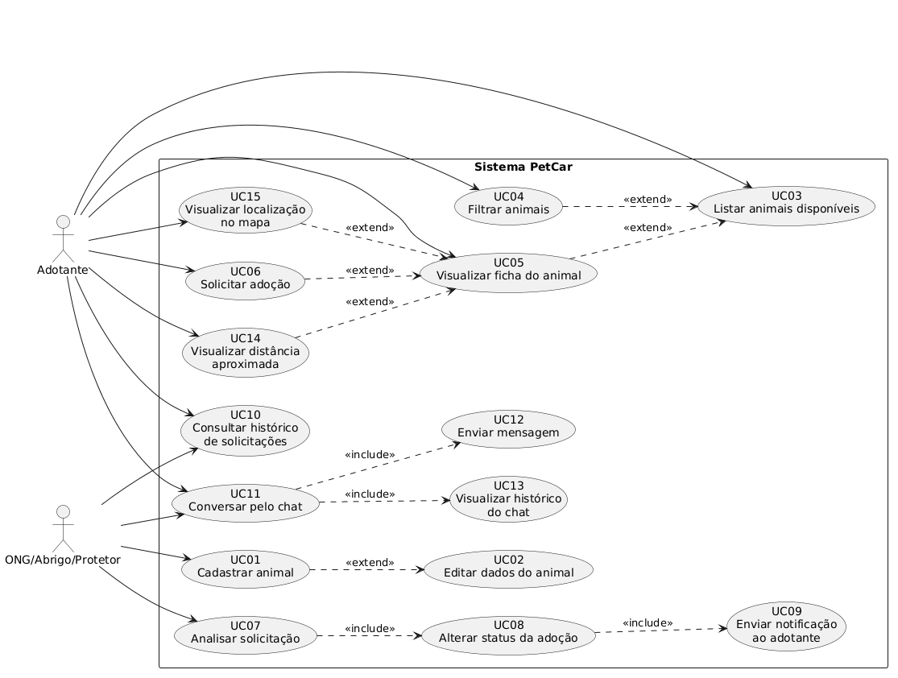 |
| Diagrama de Classes | 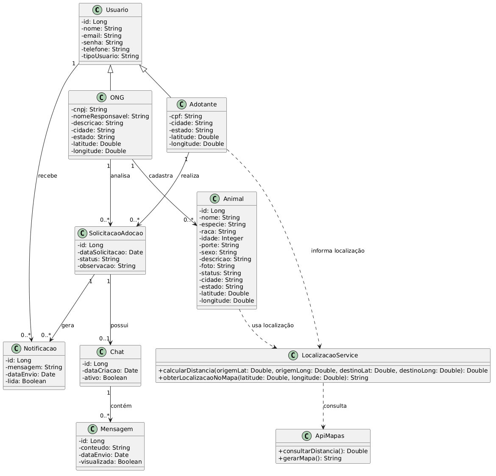 |
| Diagrama de Arquitetura | 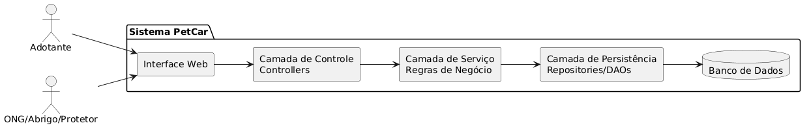 |
| Diagrama de Componentes | 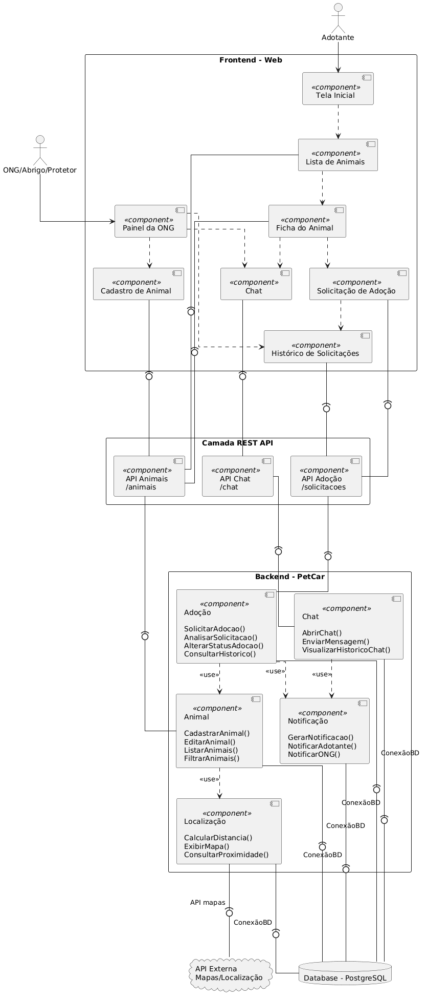 |
| Diagrama de Implantação | 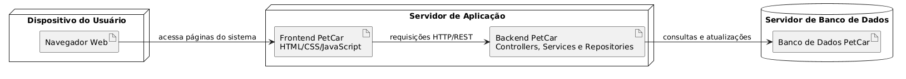 |
| Modelo de Banco |  |

---

### Diagramas de Sequência

| Diagrama | Imagem |
|---|---|
| Solicitação de adoção | 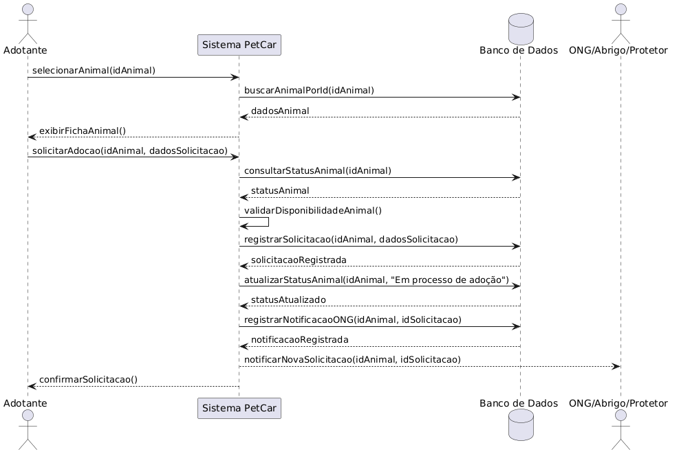 |
| Analisar solicitação | 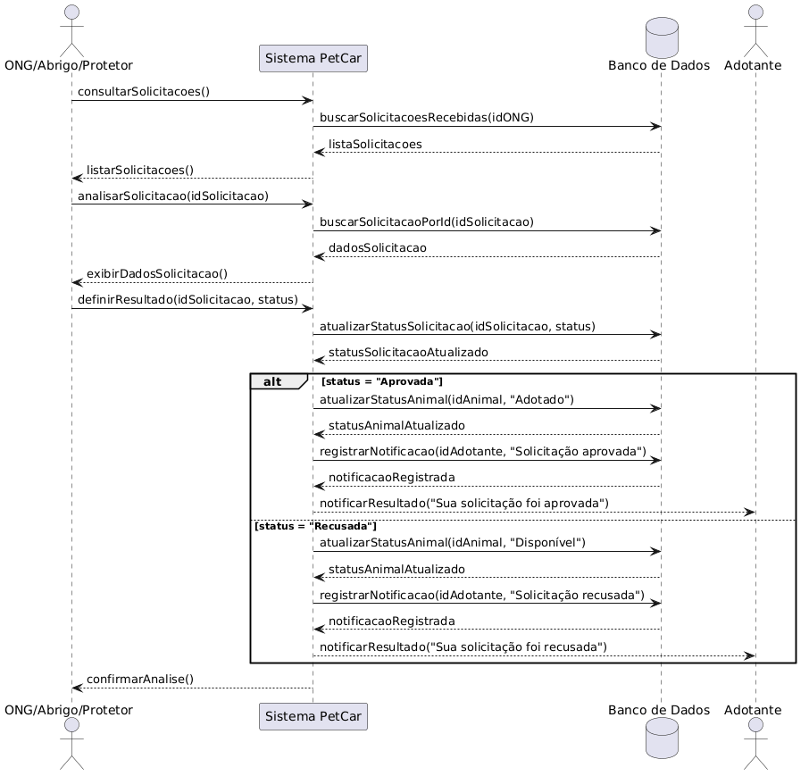 |
| Enviar mensagem | 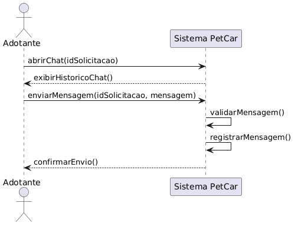 |
| Cadastrar animal |  |
| Consultar e filtrar animais |  |
| Localização e proximidade |  |

---

### Diagramas de Comunicação

| Diagrama | Imagem |
|---|---|
| Solicitação de adoção | 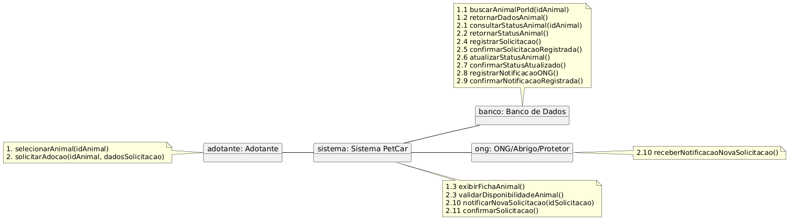 |
| Analisar solicitação | 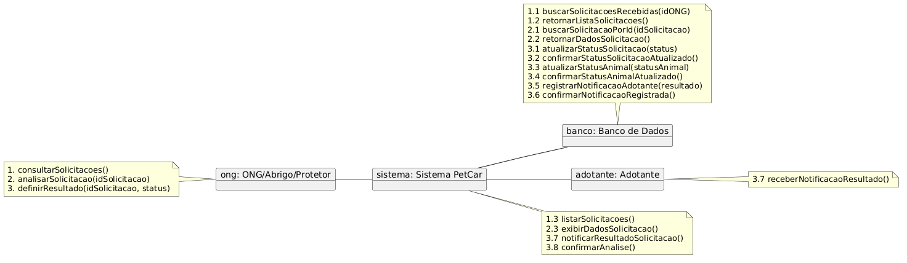 |
| Enviar mensagem | 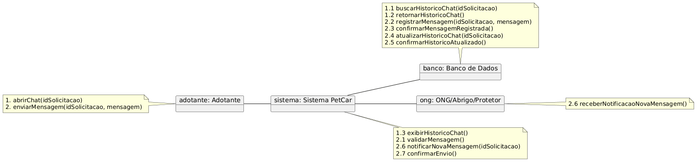 |
| Consultar animal com filtro de localização e proximidade | 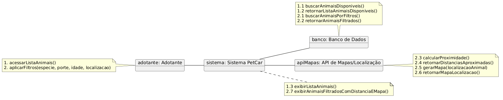 |

---

### Diagramas de Estado

| Diagrama | Imagem |
|---|---|
| Estado do Animal | 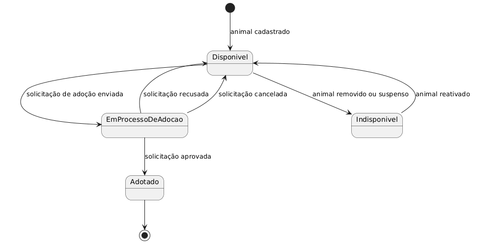 |
| Estado do Chat | 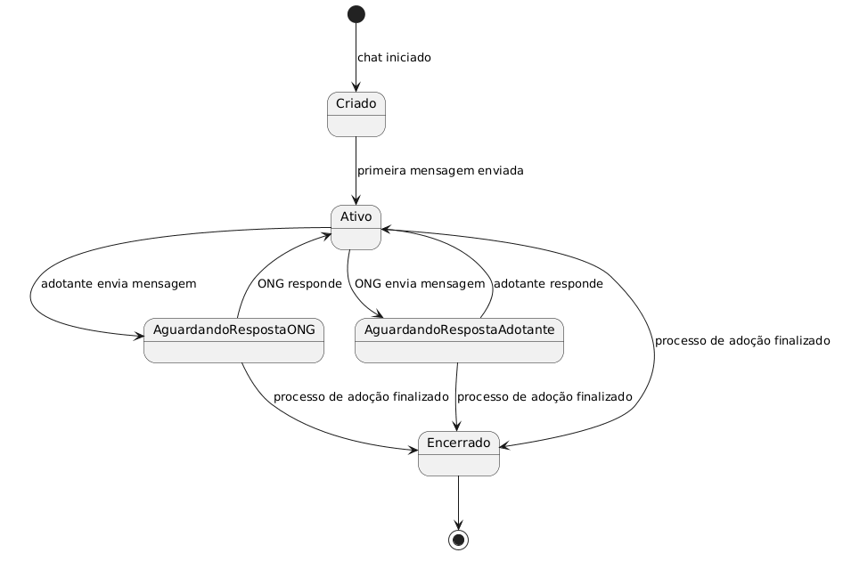 |
| Estado da Solicitação de Adoção | 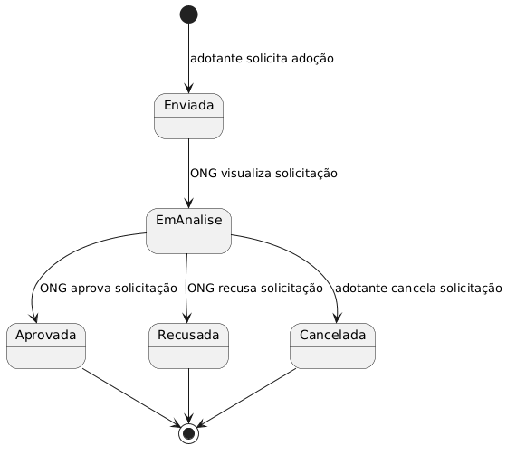 |

---

## 🗃 Modelo de Dados

O sistema utilizará banco de dados relacional **PostgreSQL**. As principais tabelas previstas são:

* `usuario`;
* `adotante`;
* `ong`;
* `animal`;
* `solicitacao_adocao`;
* `chat`;
* `mensagem`;
* `notificacao`.

### Relacionamentos principais

* Um usuário pode ser um adotante ou uma ONG;
* Uma ONG pode cadastrar vários animais;
* Um adotante pode realizar várias solicitações de adoção;
* Um animal pode receber várias solicitações;
* Uma solicitação pode possuir um chat;
* Um chat pode conter várias mensagens;
* Um usuário pode receber várias notificações;
* Uma solicitação pode gerar várias notificações.

A API de localização não possui tabela própria, pois representa um serviço externo. Os dados necessários para seu uso, como cidade, estado, latitude e longitude, são armazenados nas entidades `adotante`, `ong` e `animal`.
---

## 📌 Status dos Animais

Os animais cadastrados podem possuir os seguintes estados:

* **Disponível:** animal visível para adoção;
* **Em processo de adoção:** existe solicitação em análise;
* **Adotado:** solicitação aprovada;
* **Indisponível:** animal removido ou temporariamente ocultado.

---

## 📌 Status das Solicitações

As solicitações de adoção podem possuir os seguintes estados:

* **Enviada:** solicitação criada pelo adotante;
* **Em análise:** solicitação visualizada ou avaliada pela ONG;
* **Aprovada:** pedido aceito pela ONG;
* **Recusada:** pedido negado pela ONG;
* **Cancelada:** pedido cancelado antes da finalização.

---

## 📌 Histórico de Revisões

| Nome           | Data     | Razões para Mudança                                                                                                              | Versão |
| -------------- | -------- | -------------------------------------------------------------------------------------------------------------------------------- | ------ |
| Diogo Henrique | 07/06/26 | Criação do repositório                                                                                                           | 0.1    |
| Diogo Henrique | 07/06/26 | Inclusão do diagrama de casos de uso e dos diagramas de sequência iniciais                                                       | 0.2    |
| Diogo Henrique | 08/06/26 | Inclusão dos diagramas de arquitetura, implantação e classes; atualização dos casos de uso e histórias de usuário                | 0.3    |
| Diogo Henrique | 09/06/26 | Inclusão dos diagramas de sequência, comunicação e estados; inclusão do modelo de dados e atualização do diagrama de componentes | 0.4    |
| Diogo Henrique | 10/06/26 | Atualização do README e revisão final da documentação                                                                            | 1.0    |

---

## 👥 Autores

| Nome                            | Curso                  | Instituição |
| ------------------------------- | ---------------------- | ----------- |
| Diogo Henrique Moreira da Silva | Engenharia de Software | PUC Minas   |

---

## 📄 Licença

Este projeto foi desenvolvido para fins acadêmicos.

---
